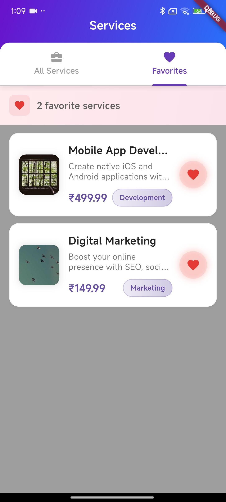
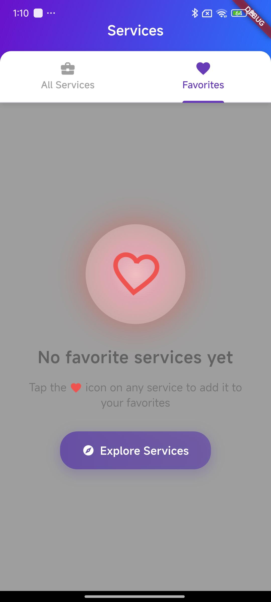
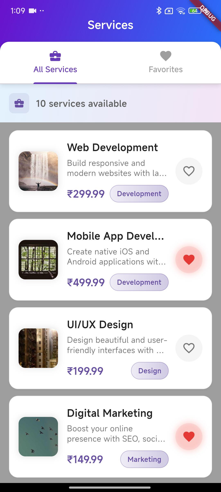

# favorite_services

A Flutter app showcasing **Clean Architecture** with **Hive database** and **Cubit state management**.  
It allows browsing mock services, marking favorites, and works fully offline.

## Getting Started

This project demonstrates:

- Browse 10 mock services with images, descriptions, and prices  
- Add/remove favorites (persisted locally with Hive)  
- Switch between "All Services" and "Favorites" tabs  
- Pull-to-refresh functionality  
- Works completely offline  

## Tech Stack

- **Architecture**: Clean Architecture (Domain, Data, Presentation)  
- **State Management**: Cubit (Flutter BLoC)  
- **Local Storage**: Hive database with type adapters  
- **Dependency Injection**: GetIt service locator  
- **Testing**: Unit, Widget & Integration tests  

## Quick Commands

- Install deps → `flutter pub get`  
- Generate Hive adapters → `flutter packages pub run build_runner build`  
- Run app → `flutter run`  
- Run tests → `flutter test`  

## Screenshots

## Favorite Page



### All Services Page


## 🎥 Demo
[Watch Demo Video](docs/demo_video.gif)

## 📦 Download APK
[⬇️ Download APK](docs/app-release.apk)
```
